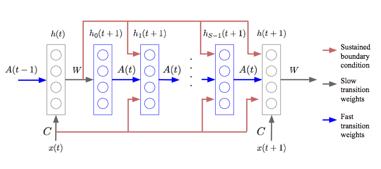

+++
date = '2026-01-05T12:14:58+08:00'
draft = false
title = 'Test Time Training(TTT) and Attention mechanisms'
math = true
unsafe = false
+++

> **TL;DR**: This post examines **Fast Weight Programming** and **Test-Time Training (TTT)** as mechanisms for dynamic memory in neural networks. We illustrate how TTT updates hidden states on-the-fly using gradient descent, exemplified by the **Delta Rule**. Furthermore, we unify modern linear attention architectures (e.g., Mamba, RWKV, RetNet) under the TTT framework and compare their computational characteristics with RNNs and Self-Attention.

# 1.Fast weight programing

**Fast Weight Programming** is a mechanism that dynamically adjusts neural network weights based on the input sequence, enabling the model to maintain a form of short-term memory. Below is the abstract from the seminal paper *'Using Fast Weights to Attend to the Recent Past'*:
> Until recently, research on artificial neural networks was largely restricted to systems with only two types of variable: **Neural activities** that represents the current or recent input and **weights** that learn to capture regularities among input, outputs and payoffs. However, synapses have dynamics at many different time-scales. Artificial neural networks might benefit from variables that change slower than activities but much faster than the standard weights. These **“fast weights”** can be used to store temporary memories of the recent past and they provide a neurally plausible way of implementing the type of attention to the past. By using fast weights we can avoid the need to store copies of neural activity patterns.

Fast weights separates RNN's memory into two components to free up the its hidden state for computation rather than memorization:
1.  **Slow weights ($W$)**: Standard RNN weights, learned via backpropagation, holding long-term knowledge.
2.  **Fast weights ($A(t)$)**: Dynamic weights changing at every timestep via a Hebbian-like rule, holding short-term memory of the recent past.

**Update Rule (Hebbian Learning)**:
The fast weights $A(t)$ are updated based on the outer product of the hidden state:
$$
A(t+1) = \lambda A(t) + \eta h(t)h(t)^T
$$
where $\lambda$ is the decay rate and $\eta$ is the learning rate.

# 2. Test Time Training (TTT)
## 2.1 TTT Formulation
Test-Time Training (TTT) retrieves data relevant to the input from the training set or knowledge base during inference to fine-tune the model, improving its performance in dynamic scenarios.

Consider a one-dimensional sequence of $N$ tokens $\mathbf{x} = [x_1, x_2, \dots, x_N]$, where each token $x_i \in \mathbb{R}^d$. Following attention formulation, each input token $x_i$ is projected into query ($q_i$), key ($k_i$), and value ($v_i$) vectors. For clarity, we assume all these vectors $q_i, k_i, v_i \in \mathbb{R}^d$.

Test-Time Training (TTT) introduces a neural network with rapidly adaptable weights (**fast weights**) that are updated during both training and inference to dynamically store context information. This contrasts with the **slow weights** (i.e., model parameters) that are frozen during inference. Formally, TTT defines fast weights in the form of a neural network: $f_W (\cdot) : \mathbb{R}^d \to \mathbb{R}^d$ parameterized by the fast weights $W$, and it involves two primary operations:

**Update operation**:
$$
W \leftarrow W - \eta\nabla_W \mathcal{L}
$$
where $\mathcal{L}(\cdot, \cdot)$ is a loss function between the transformed key $f_W (k)$ and the value $v$, commonly Mean Squared Error, designed to encourage the network to associate keys with corresponding values (**KV-Binding**). $\eta$ is the learning rate. Intuitively, this learning objective is to encode the KV cache into a neural memory with fixed state size as accurate as possible.

**Output rule**:
$$
o = f_W (q)
$$
where the updated fast weights $W$ are used to compute the output vector $o$ given the query $q$. The per-token TTT layer iteratively performs the update and apply operations on each token $x_i$ in sequence.

## 2.2 Example: DeltaRule under TTT framework
DeltaNet reinterprets the recurrence as online gradient **descent** on a reconstruction objective:

$$
\mathcal{L}_t(\mathbf{S}) = \frac{1}{2}\|\mathbf{S}^\top\boldsymbol{k}_t - \boldsymbol{v}_t\|^2
$$

Taking a gradient step with learning rate $\beta_t$ gives:

`$$
\begin{aligned}
\mathbf{S}_t
&= \mathbf{S}_{t-1} - \beta_t \nabla_\mathbf{S}\mathcal{L}_t(\mathbf{S}_{t-1}) \\
&= \mathbf{S}_{t-1} - \beta_t \boldsymbol{k}_t (\mathbf{S}_{t-1}^\top \boldsymbol{k}_t - \boldsymbol{v}_t)^\top \\
&= \mathbf{S}_{t-1} - \beta_t \boldsymbol{k}_t \boldsymbol{k}_t^\top \mathbf{S}_{t-1} + \beta_t \boldsymbol{k}_t \boldsymbol{v}_t^\top \\
&= (\mathbf{I}-\beta_t\boldsymbol{k}_t\boldsymbol{k}_t^\top) \mathbf{S}_{t-1} + \beta_t\boldsymbol{k}_t\boldsymbol{v}_t^\top
\end{aligned}
$$`

This rule—the classical **delta rule**—treats $\mathbf{S}$ as a learnable associative memory that continually corrects itself toward the mapping $\boldsymbol{k}_t \mapsto \boldsymbol{v}_t$.

## 2.3 Unified Linear Attention mechanisums under TTT framework

An overview of different attention mechanisms through the lens of state updating rules and their learning objective under the TTT framework. All normalizer terms and activation/kernel functions are ignored for brevity.

| Model | Objective $\mathcal{L}$ | Update rule `$\mathbf{S}_t = \mathbf{S}_{t-1} - \nabla_{\mathbf{S}_{t-1}}\mathcal{L}$` |
| :--- | :--- | :--- |
| LA | $-\langle\mathbf{S}_{t-1}^\top \boldsymbol{k}_t, \boldsymbol{v}_t\rangle$ | `$\mathbf{S}_t = \mathbf{S}_{t-1}+\boldsymbol{k}_t\boldsymbol{v}_t^\top$` |
| RetNet | `$-{\beta_t}\langle\mathbf{S}_{t-1}^\top \boldsymbol{k}_t, \boldsymbol{v}_t\rangle+\frac{1}{2}\|\sqrt{1-\mathbf{\alpha}}~\mathbf{S}_{t-1}\|_F^2$` | `$\mathbf{S}_t = \alpha\mathbf{S}_{t-1}+{\beta_t}\boldsymbol{k}_t\boldsymbol{v}_t^\top$` |
| Mamba2 | `$-{\beta_t}\langle\mathbf{S}_{t-1}^\top \boldsymbol{k}_t, \boldsymbol{v}_t\rangle+\frac{1}{2}\|\sqrt{1-\mathbf{\alpha}_t}\mathbf{S}_{t-1}\|_F^2$` | `$\mathbf{S}_t = \alpha_t\mathbf{S}_{t-1}+{\beta_t}\boldsymbol{k}_t\boldsymbol{v}_t^\top$` |
| GLA | `$-\langle\mathbf{S}_{t-1}^\top \boldsymbol{k}_t, \boldsymbol{v}_t\rangle+\frac{1}{2}\|\sqrt{\operatorname{Diag}(\boldsymbol{1}-\boldsymbol{\alpha}_t)}\mathbf{S}_{t-1}\|_F^2$` | `$\mathbf{S}_t = \operatorname{Diag}(\boldsymbol{\alpha}_t)\mathbf{S}_{t-1}+\boldsymbol{k}_t\boldsymbol{v}_t^\top$` |
| HGRN2 | `$-\langle\mathbf{S}_{t-1}^\top (\mathbf{1-\boldsymbol{\alpha}}_t), \boldsymbol{v}_t\rangle+\frac{1}{2}\|\sqrt{\operatorname{Diag}(\boldsymbol{1}-\boldsymbol{\alpha}_t)}\mathbf{S}_{t-1}\|_F^2$` | `$\mathbf{S}_t = \operatorname{Diag}(\boldsymbol{\alpha}_t)\mathbf{S}_{t-1}+(\mathbf{\boldsymbol{1}-\boldsymbol{\alpha}}_t)\boldsymbol{v}_t^\top$` |
| Longhorn | `$\frac{1}{2}\|\mathbf{S}_{t-1}^\top \boldsymbol{k}_t-\boldsymbol{v}_t \|^2_{\operatorname{Diag}(\boldsymbol{\beta}_t)}$` | `$\mathbf{S}_t = (\mathbf{I} -\frac{\boldsymbol{\beta}_t}{\boldsymbol{1}+\boldsymbol{\beta}_t\boldsymbol{k}_t^\top\boldsymbol{k}_t}\boldsymbol{k}_t\boldsymbol{k}_t^\top)\mathbf{S}_{t-1}+{\beta_t}\boldsymbol{k}_t\boldsymbol{v}_t^\top$` |
| Comba | `$\frac{{\beta_t}}{2}\|\mathbf{S}_{t-1}^\top \boldsymbol{k}_t -\boldsymbol{v}_t\|^2+\frac{1}{2}\|\sqrt{1-\mathbf{\alpha}_t}\mathbf{S}_{t-1}\|_F^2$` | `$\mathbf{S}_t = (\alpha_t -\beta_t\boldsymbol{k}_t\hat{\boldsymbol{k}}_t^\top)\mathbf{S}_{t-1}+{\beta_t}\boldsymbol{k}_t\boldsymbol{v}_t^\top$` |
| RWKV7 | `$\frac{1}{2}\|\mathbf{S}_{t-1} ^\top\tilde{\boldsymbol{k}}_t-\boldsymbol{v}_t\|^2+\frac{1}{2}\|\sqrt{\operatorname{Diag}(\boldsymbol{1}-\boldsymbol{\alpha}_t)}\mathbf{S}_{t-1}\|_F^2$` | `$\mathbf{S}_t = (\operatorname{Diag}(\boldsymbol{\alpha}_t)-(\boldsymbol{b}_s\odot\hat{\boldsymbol{k}}_s)\hat{\boldsymbol{k}}_t^\top)\mathbf{S}_{t-1}+{\boldsymbol{k}}_t\boldsymbol{v}_t^\top$`|
| GDN | `$\frac{{\beta_t}}{2}\|\tilde{\mathbf{S}}_{t-1}^\top \boldsymbol{k}_t-\boldsymbol{v}_t\|^2$` | `$\mathbf{S}_t = (\mathbf{I}-{\beta}_t\boldsymbol{k}_t\boldsymbol{k}_t^\top)\alpha_t\mathbf{S}_{t-1}+{\beta}_t\boldsymbol{k}_t\boldsymbol{v}_t^\top$` |
| KDA | `$\frac{\beta_t}{2}\|\tilde{\mathbf{S}}_{t-1}^\top {\boldsymbol{k}_t}-\boldsymbol{v}_t\|^2$` | `$\mathbf{S}_t = (\mathbf{I} -\beta_t\boldsymbol{k}_t\boldsymbol{k}_t^\top)\operatorname{Diag}(\boldsymbol{\alpha}_t)\mathbf{S}_{t-1}+{\beta_t}\boldsymbol{k}_t\boldsymbol{v}_t^\top$` |

> For GDN and KDA, the update can be viewed as performing an Stochastic Gradient Descent (SGD) process on the decayed state `$\tilde{\mathbf{S}}$`, that is, `$\mathbf{S}_t = \tilde{\mathbf{S}}_{t-1} - \nabla_{\tilde{\mathbf{S}}_{t-1}}\mathcal{L}$`, where `$\tilde{\mathbf{S}}_{t-1}$` is decayed by scalar or fine-grained gate.

# 3.Comparison of Sequence Modeling Paradigms under TTT framework

Here is a comparison of three sequence modeling approaches from the perspective of Test-Time Training:

| | Initial state | Update rule | Output rule | Cost |
| :--- | :--- | :--- | :--- | :--- |
| **Naive RNN** | $s_0 = \text{vector}()$ | $s_t = \sigma (\theta_{ss}s_{t-1} + \theta_{sx}x_t)$ | $z_t = \theta_{zs}s_t + \theta_{zx}x_t$ | $O(1)$ |
| **Self-attention** | $s_0 = \text{list}()$ | $s_t = s_{t-1}.\text{append}(k_t, v_t)$ | $z_t = V_t\text{softmax}(K_t^T q_t)$ | $O(t)$ |
| **Naive TTT** | $W_0 = f.\text{params}()$ | $W_t = W_{t-1} - \eta\nabla \ell(W_{t-1}; x_t)$ | $z_t = f(x_t; W_t)$ | $O(1)$ |

Self-attention differs fundamentally from RNNs and TTT in how it manages memory. While RNNs and TTT compress historical context into a fixed-size hidden state (resulting in constant $O(1)$ cost per token), Self-attention maintains an ever-growing list known as the Key-Value (KV) cache. Its "update rule" is trivial—simply appending new keys and values—but its "output rule" requires scanning the entire history to compute the attention matrix. This lack of compression grants Self-attention superior expressivity for long contexts, but it comes at the price of linear computational complexity $O(t)$ per token as the sequence lengthens.

## reference
* Ba, J. et al. (2016) “Using Fast Weights to Attend to the Recent Past.” arXiv. Available at: https://doi.org/10.48550/arXiv.1610.06258.
* Sun, Y. et al. (2025) “Learning to (Learn at Test Time): RNNs with Expressive Hidden States.” arXiv. Available at: https://doi.org/10.48550/arXiv.2407.04620.
* Zhang, T. et al. (2025) “Test-Time Training Done Right.” arXiv. Available at: https://doi.org/10.48550/arXiv.2505.23884.
* Hu, J. et al. (2025) “Test-Time Learning for Large Language Models.” arXiv. Available at: https://doi.org/10.48550/arXiv.2505.20633.
* Team, K. et al. (2025) “Kimi Linear: An Expressive, Efficient Attention Architecture.” arXiv. Available at: https://doi.org/10.48550/arXiv.2510.26692.

